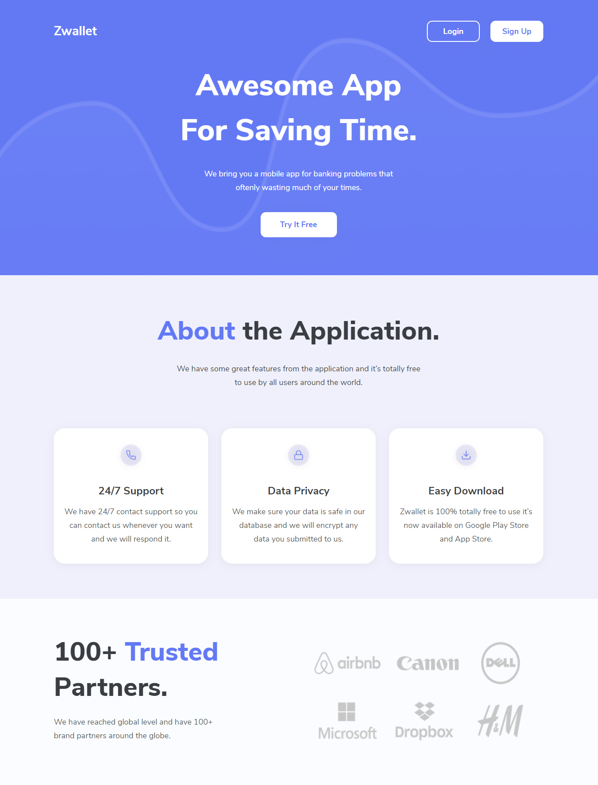
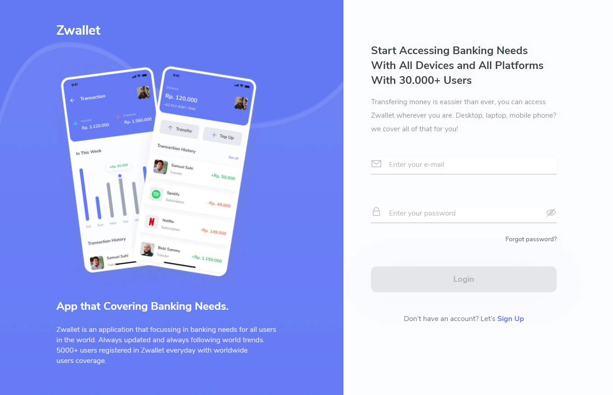
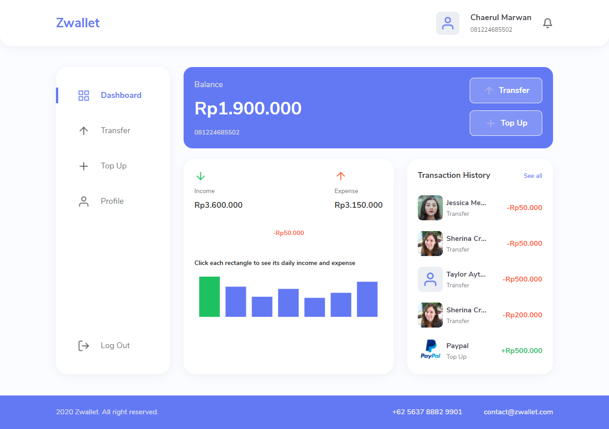
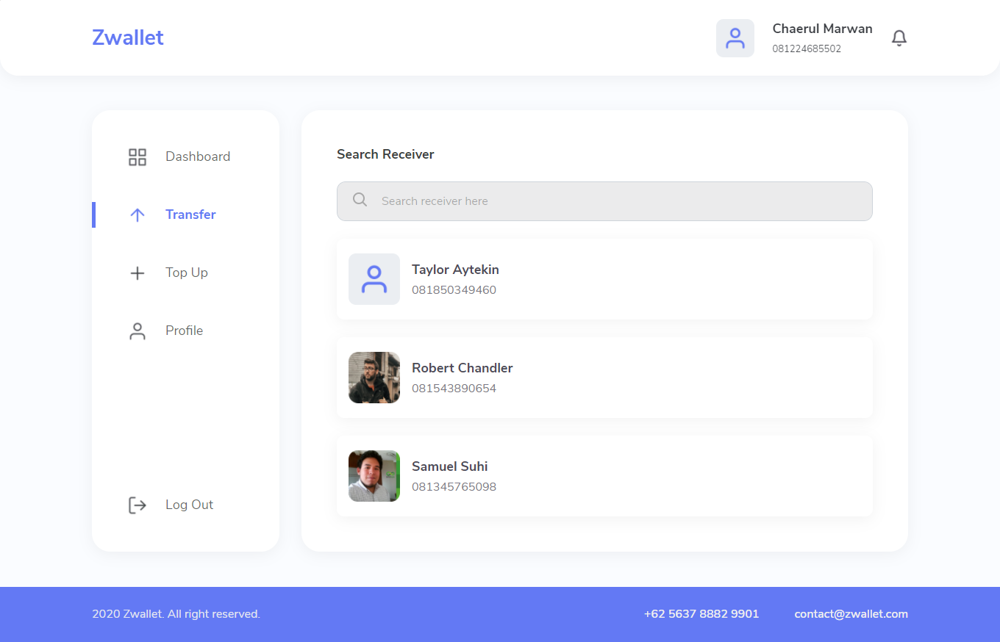
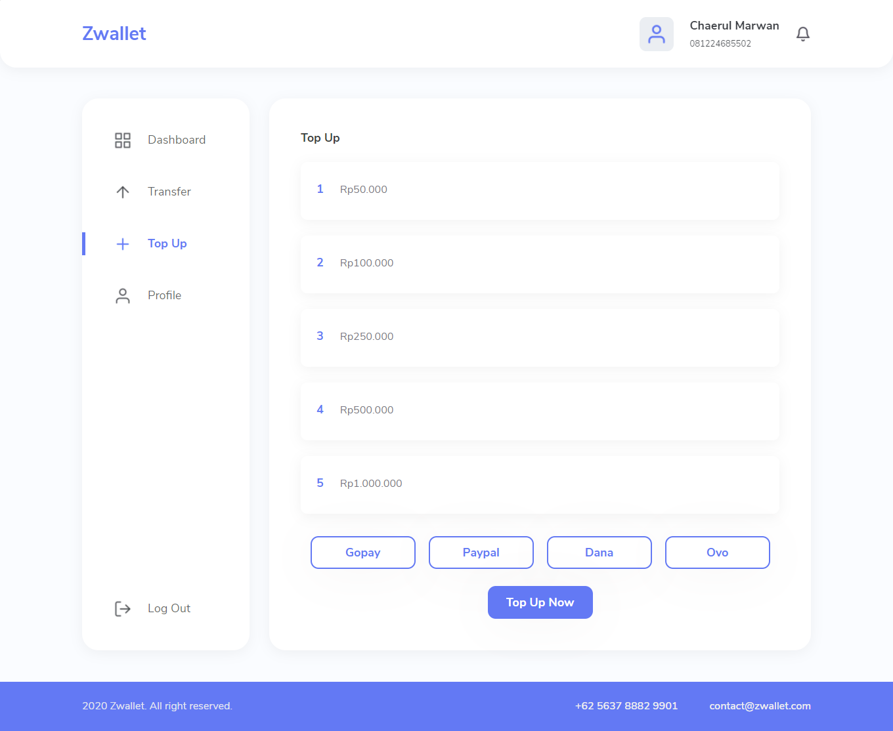
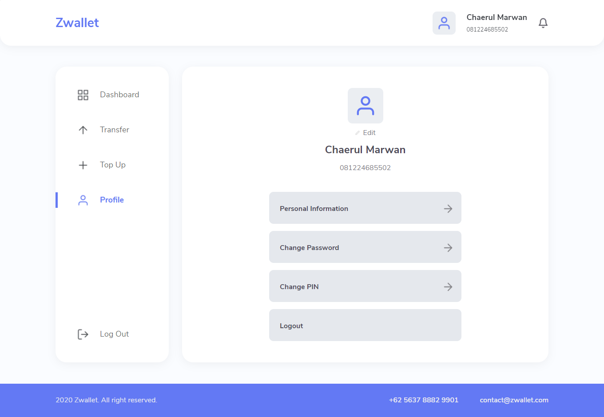

<h1 align="center">Zwallet</h1>
<p align="center">
  <a href="https://zwallet-banking.vercel.app/" target="_blank"></a>
</p>

## Table of Contents

- [Introduction](#introduction)
- [Features](#features)
- [Built With](#built-with)
- [Prerequisites](#prerequisites)
- [Installation](#installation)
- [Screenshots](#screenshots)
- [Related Project](#related-project)

## Introduction

Zwallet is a digital wallet application that simplifies your financial needs and can save a lot of time on your banking needs with just one application. Zwallet is in the field of digital banking, which is increasingly developing rapidly as technology advances. This application is able to save money, make transfers between users or top up balances.

## Features

- Authentication

- Topup

- Transfer

- Realtime balance

- Upload image profile

- Reset password

- PIN security while transfer, and topup

- Change password

- Change pin

- Change profile

## Built With

- [NextJS](https://nextjs.org/)

- [Bootstrap](https://getbootstrap.com/)

- [Redux](https://redux.js.org/)

## Prerequisites

- [NodeJs](https://nodejs.org/en/download/)
- [Backend Zwallet](https://github.com/chaerulmarwan20/zwallet-backend)

## Installation

1. Open your terminal or command prompt. Then, clone the repo.

```
$ git clone git clone https://github.com/chaerulmarwan20/zwallet-frontend.git
```

2. Open this project.

```
$ cd zwallet-frontend
$ npm install
```

3. Run this application.

```
$ npm run dev
```

## Screenshots

<p align="center">
  <span>
       
       
       
    
       
    
  </span>
</p>

## Related Project

- :white_check_mark: [`Backend Zwallet`](https://github.com/chaerulmarwan20/zwallet-backend)
- :rocket: [`Production`](https://zwallet-banking.vercel.app/)
